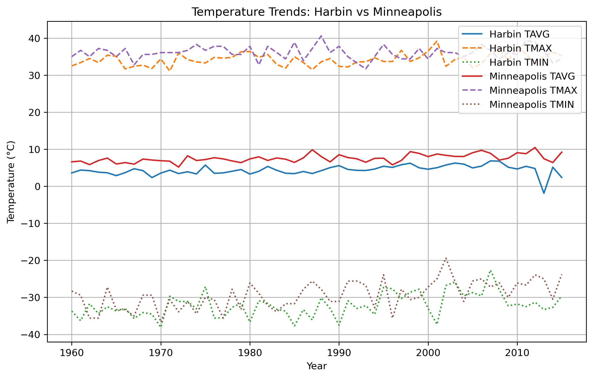
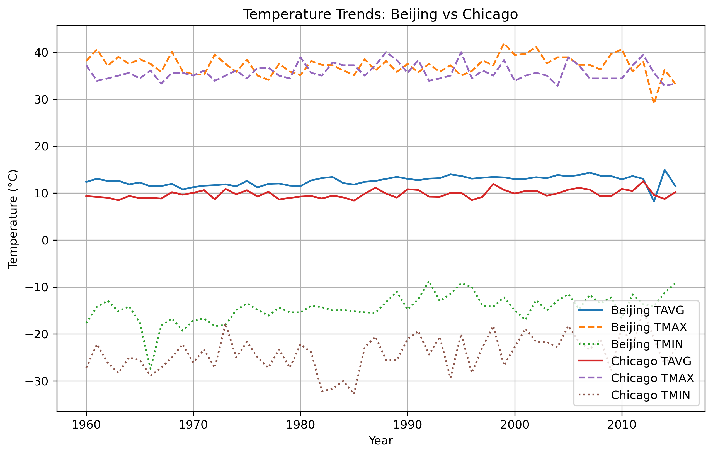
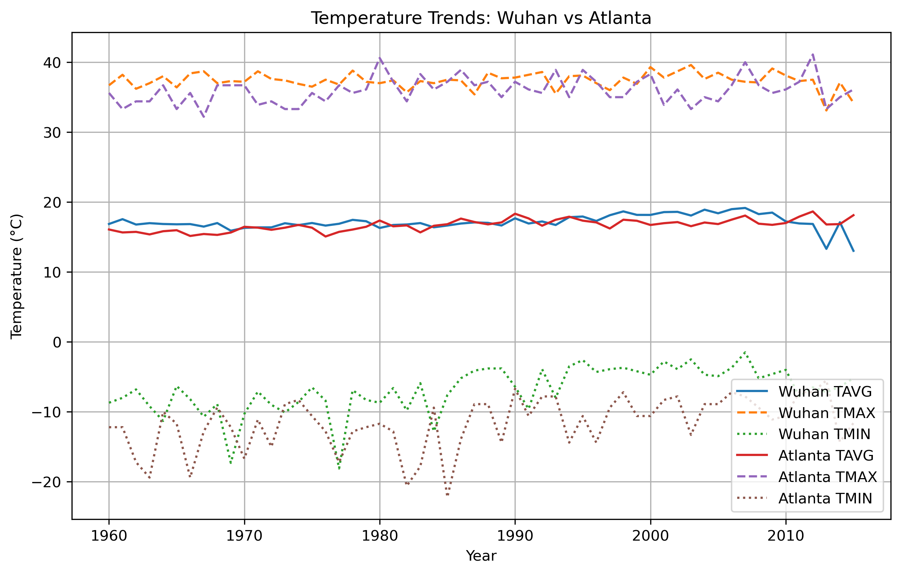
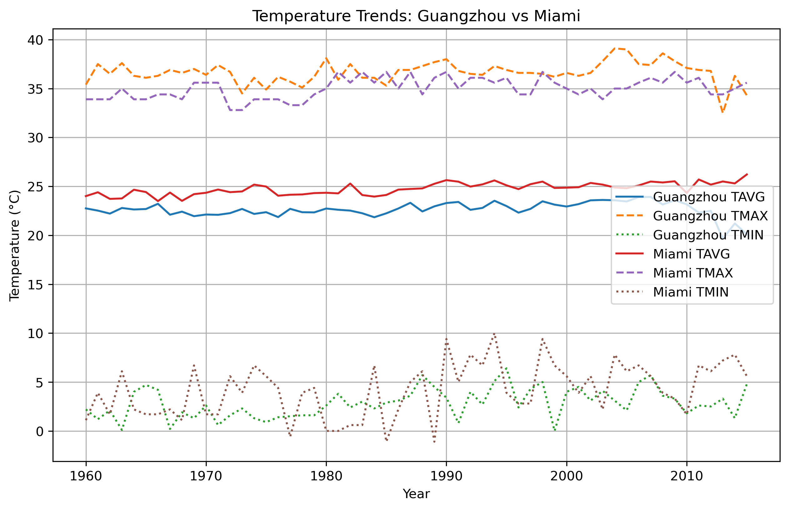
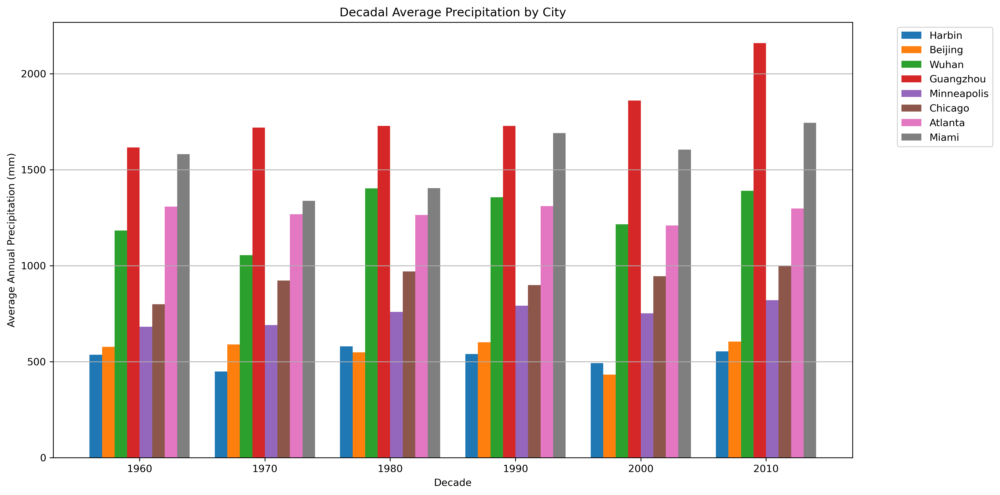

# Climate Change Comparison between China and the United States: A Multi-Region Temperature and Precipitation Analysis (1951–2015)

## 1. Introduction

Climate change, driven primarily by human-induced greenhouse gas emissions, is widely acknowledged as one of the defining issues of our era. Despite extensive global awareness, regional differences and local variations in climate responses are less thoroughly documented. This research examines the comparative long-term trends in temperature and precipitation across paired cities in China and the United States, carefully matched by latitude and climatic zones. The investigation originates from a personal observation of increased temperatures and frequent extreme weather events in China. Through a systematic data analysis, this study aims to validate these experiences and uncover patterns that might be relevant to climate policy considerations in both countries.

## 2. Data Sources

Data for this analysis is derived from the NOAA's Global Historical Climatology Network - Daily (GHCN-Daily). The analysis comprises eight cities, paired according to similar latitudes and climatic characteristics. The selected cities summarized in Table 1 below:

| China City | U.S. City   | Climate Zone                 |
| ---------- | ----------- | ---------------------------- |
| Harbin     | Minneapolis | Cold continental             |
| Beijing    | Chicago     | Temperate continental        |
| Wuhan      | Atlanta     | Subtropical humid            |
| Guangzhou  | Miami       | Tropical/subtropical coastal |

The analysis utilized daily maximum temperature (TMAX), daily minimum temperature (TMIN), and daily precipitation (PRCP) data spanning **1951 to 2015**, providing a robust temporal frame to assess climate changes over multiple decades.

## 3. Methods

### 3.1 Data Cleaning and Processing

Initial data processing involved removing erroneous daily records, marked by the value `-9999`. Annual average temperatures were calculated using the arithmetic mean of daily maximum and minimum temperatures:

$$
TAVG = \frac{TMAX + TMIN}{2}
$$

In addition to annual averages, yearly extreme temperatures were identified by recording the annual maximum of TMAX and the annual minimum of TMIN. Annual precipitation totals were derived by summing daily PRCP values. Data quality checks highlighted incomplete data entries for specific years, notably the anomalously incomplete records for Chinese stations during 2016–2017, which were thus excluded from the analysis to ensure reliability. temperature events were captured by recording annual maximum TMAX and annual minimum TMIN. Annual total precipitation was computed by summing daily PRCP values. Years with notably incomplete data, particularly 2016–2017 from Chinese stations, were excluded to ensure analysis integrity.

### 3.2 Warming Rate Estimation

Warming rates were quantified using linear regression of annual average temperatures (TAVG) on the year, employing the model:

$$
TAVG_{year} = \beta_0 + \beta_1 \times Year + \epsilon
$$

In this equation, $\beta_1$ represents the warming rate (°C/year), providing a direct measure of temperature change over the analyzed period. The term $\epsilon$ captures the error or unexplained variance within the regression. This regression was performed separately for each city, allowing comparison of warming rates across different regions.

### 3.3 Decadal Precipitation Analysis

Given the high variability inherent in annual precipitation data, this study aggregated precipitation measurements into decadal averages. This approach mitigates short-term fluctuations, facilitating clearer observation of long-term precipitation trends.

## 4. Results

### 4.1 Long-term Average Temperature Trends (TAVG)

The analysis confirms clear warming trends across all cities, particularly noticeable after 1980. Southern cities, such as Guangzhou and Miami, naturally exhibit higher baseline temperatures due to their geographical locations. Conversely, northern cities like Harbin and Minneapolis, despite lower baseline temperatures, demonstrate considerable warming. These results suggest a latitudinal component in warming intensity and underscore the complex interplay between geographic location and climate change.

.png)

### 4.2 Latitude-Based Pairwise Comparisons

The pairwise analysis reveals notable findings. Harbin and Minneapolis, representing cold continental climates, exhibit pronounced warming, especially in winter minimum temperatures. However, Minneapolis displays a marginally higher warming rate, indicating potentially stronger climate impacts in northern U.S. cities compared to their Chinese counterparts.

In the temperate continental comparison, Beijing demonstrates considerable temperature variability, possibly reflecting intense urbanization effects. In contrast, Chicago's temperature trends remain relatively stable, though still indicative of warming. Beijing also shows more extreme heat events, reflected in higher peaks of maximum temperatures.

In subtropical zones, Wuhan and Atlanta show similar warming patterns. Wuhan displays increased variability post-2000, likely influenced by urban expansion, rapid industrialization, and potential data irregularities affecting measurement consistency.

Lastly, tropical/subtropical coastal cities, Guangzhou and Miami, consistently register high baseline temperatures. Nevertheless, Miami exhibits stronger warming trends, potentially indicating regional climate sensitivity differences despite similar latitudes and maritime influences.

### 4.3 Warming Rate Comparison

Linear regression analyses underscore the heterogeneity in warming rates among cities. Minneapolis and Atlanta demonstrate the highest warming rates, reflecting potentially enhanced susceptibility to climate change at certain latitudes or local environmental factors. Notably, Guangzhou shows the smallest warming rate, possibly indicating moderating maritime influences or other stabilizing local climatic conditions.

.png)

### 4.4 Decadal Precipitation Trends

Analysis of decadal average precipitation highlights significant differences between regions. Guangzhou and Miami consistently record the highest precipitation levels, corresponding to their coastal locations and tropical/subtropical climates. By contrast, northern cities like Harbin and Beijing remain relatively dry, with no consistent, long-term increases observed, reflecting complexity in precipitation dynamics that do not straightforwardly parallel temperature trends.

## 5. Discussion

The results highlight several significant climate dynamics. Higher-latitude cities exhibit greater warming, particularly pronounced during winter months. This aligns with established understandings of polar amplification effects. Urbanization emerges as a critical factor influencing local climate, with Beijing’s pronounced variability and heightened temperature extremes exemplifying potential urban heat island impacts. Precipitation patterns did not indicate uniform trends, suggesting complex regional hydrological responses to warming. Limitations of this analysis include potential urban bias in temperature records and incomplete data coverage for certain periods. Future studies could enhance analysis robustness by integrating rural climate stations, snowfall data, air pollution levels, and population density metrics.

## 6. Conclusion

This comparative climate study between selected Chinese and U.S. cities confirms significant warming trends, accentuated at higher latitudes and urbanized locations. Findings reinforce the necessity of local climate strategies tailored to regional vulnerabilities. Recommended future research directions include extending data sets spatially and temporally, incorporating additional environmental metrics, and refining statistical approaches to address complexities inherent in climate data.